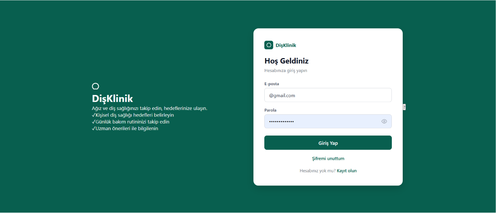
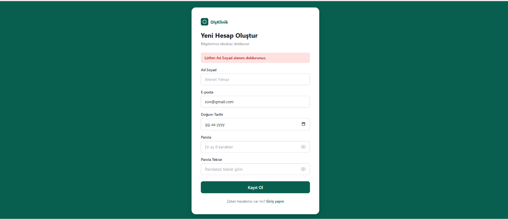
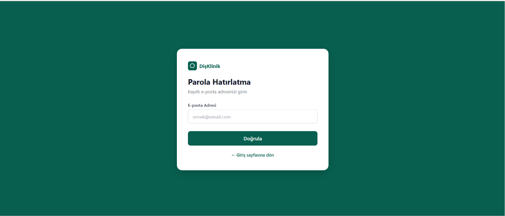
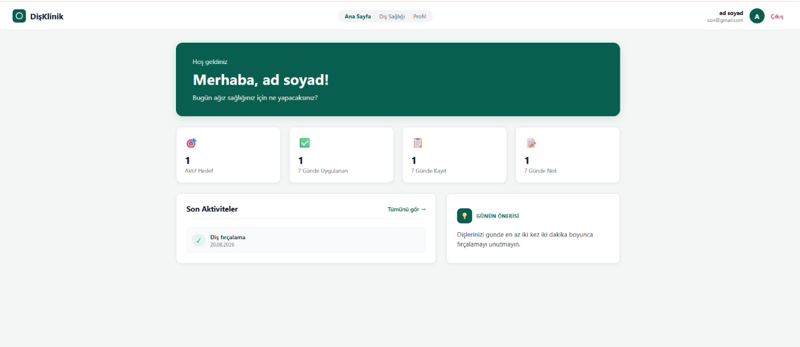
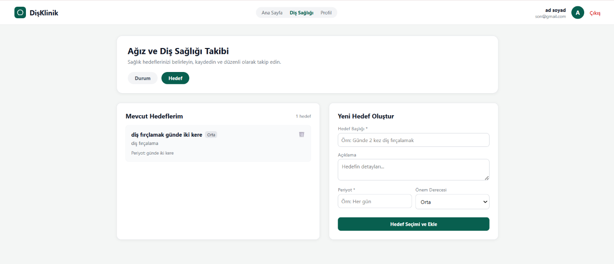
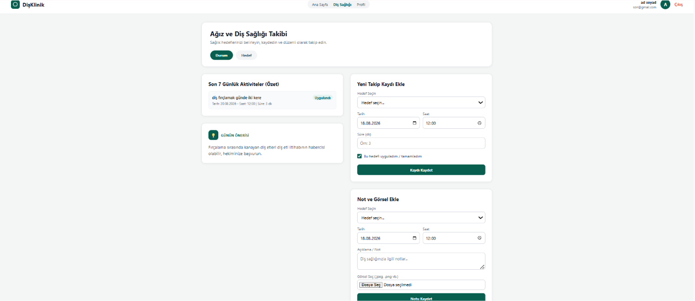
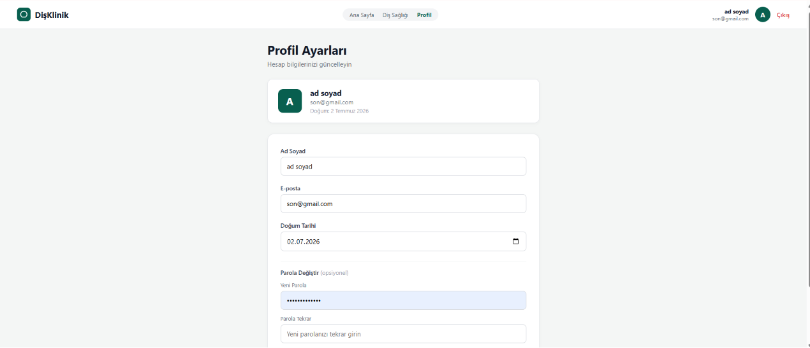
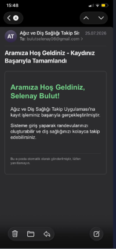
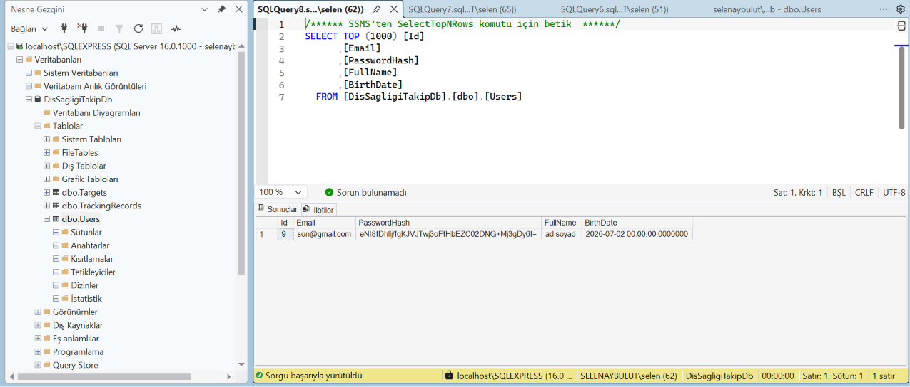

# Ağız ve Diş Sağlığı Takip Uygulaması
Kullanıcılar ağız ve diş sağlığı alışkanlıklarını izleyebilir, hedefler belirleyebilir ve uygulama ağız sağlığını iyileştirmeye yönelik önerilerde bulunabilir.

## 🚀 Kullanılan Teknolojiler
- **Frontend:** React
- **Backend:** C# ASP.NET Core Web API
- **Veritabanı:** MSSQL

## ✨ Temel Özellikler
- [ ] Özel Kimlik Yönetimi 
- [ ] Akıllı Ana Sayfa ve 7 Günlük Aktivite Özeti
- [ ] Günlük Alışkanlık ve Durum Takibi (Tarih, Süre, Görsel Notlar)
- [ ] Hedef Belirleme ve Periyot Yönetimi (Önem Derecesi ve Güvenli Silme)
- [ ] Profil Yönetimi ve Güvenli Şifreleme Altyapısı
- [ ] E-Posta Bilgilendirme Servisi
- [ ] Katmanlı Mimari ve veritabanı Entegrasyonu

## 📸 Proje Ekran Görüntüleri

| Giriş Sayfası | Kayıt Ol | Parola Hatırlatma |
| :---: | :---: | :---: |
|  |  |  |
| *Kullanıcı giriş ve kimlik doğrulama ekranı.* | *Yeni kullanıcı kayıt oluşturma paneli.* | *Şifre sıfırlama ve parola kurtarma adımı.* |

| Anasayfa | Takip Hedef | Takip Durum |
| :---: | :---: | :---: |
|  |  |  |
| *Kullanıcıyı karşılayan ana kontrol paneli.* | *Hedef belirleme ekranı.* | *Güncel durum takip modülü.* |

| Profil | Kayıt Maili | Veritabanı |
| :---: | :---: | :---: |
|  |  |  |
| *Kullanıcı hesap bilgileri ayar paneli.* | *Kayıt sonrası bilgilendirme maili.* | *Veritabanı şeması.* |

## 🛠 Kurulum

Projeyi lokalinizde çalıştırmak için aşağıdaki adımları izleyin:

### Adımlar
1. Repoyu klonlayın:
   `git clone https://github.com/SelenayBulut/Agiz-ve-Dis-Sagligi-Takip-Uygulamasi.git`

2. Backend'i çalıştırın:
   ```bash
   cd DisSagligiApp
   dotnet restore
   dotnet run

3. Frontend'i çalıştırın:
   ```bash
   cd client
   npm install
   npm run dev

4.Tarayıcıda kullanmaya başlayın:
npm run dev komutundan sonra terminalde genellikle http://localhost:5173 gibi bir link göreceksiniz.
Bu linki Ctrl + Tık yaparak veya kopyalayıp tarayıcınızın adres çubuğuna yapıştırarak uygulamaya erişebilirsiniz.

   
   


   
